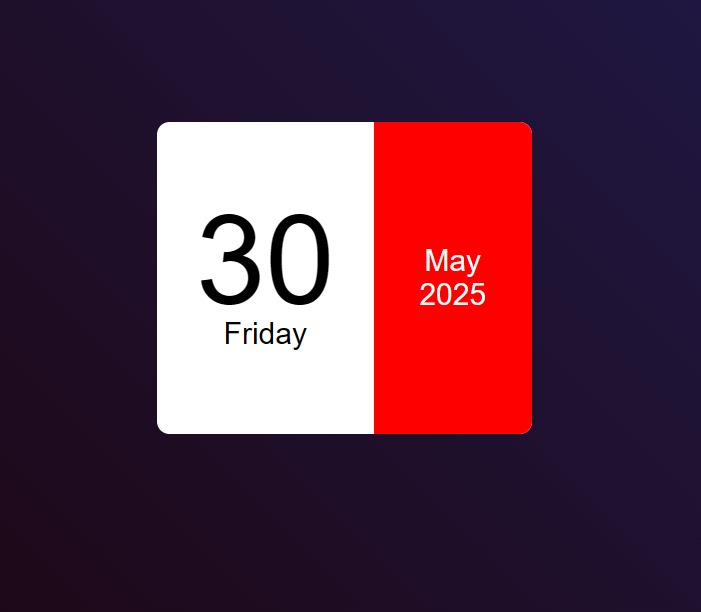

# 📆 Mini Calendar Web App

This is a simple and modern **mini calendar** built using HTML, CSS, and JavaScript. It dynamically displays the **current date, day, month, and year** based on your system clock.

Designed with a gradient background and clean layout, this project demonstrates basic **DOM manipulation**, responsive styling, and real-time date handling in vanilla JavaScript.

---

## 🌟 Features

- 🕒 Real-time display of:
  - Date (e.g., 01)
  - Day (e.g., Sunday)
  - Month (e.g., January)
  - Year (e.g., 2025)
- 💅 Beautiful layout with gradient background
- 📱 Responsive design
- 🧠 Clean and minimal code for beginners

---

## 📸 Preview



---

## 🛠️ Built With

- HTML5
- CSS3 (custom styling + flexbox)
- JavaScript (Date object + DOM)

---

## 🚀 How to Use

1. Clone or download this repository
2. Open the `index.html` file in your browser
3. View your current date in a beautifully designed calendar layout

```bash
git clone https://github.com/Dharshinilaksh/mini_calendar.git
cd mini_calendar
open index.html  # or just double-click it
